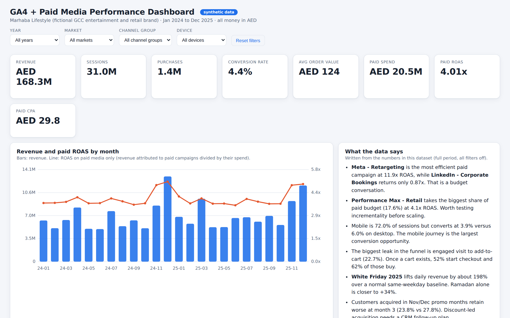
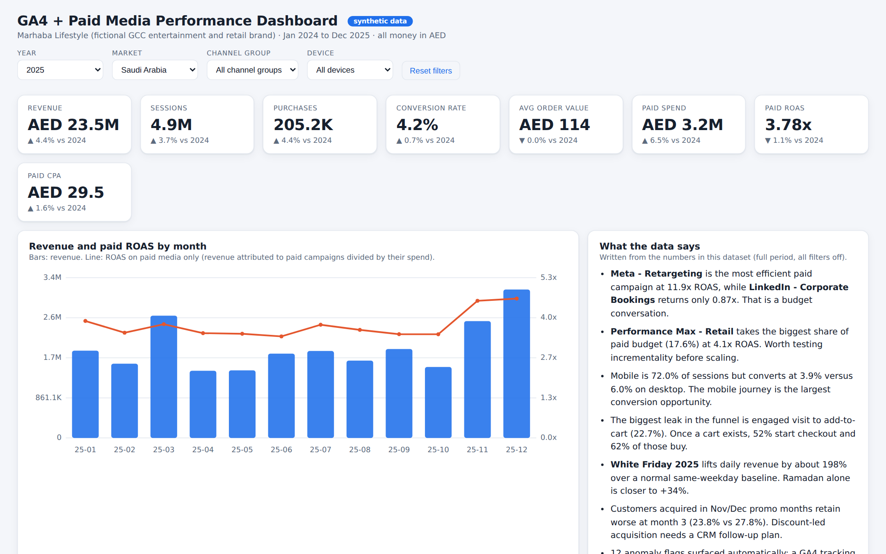
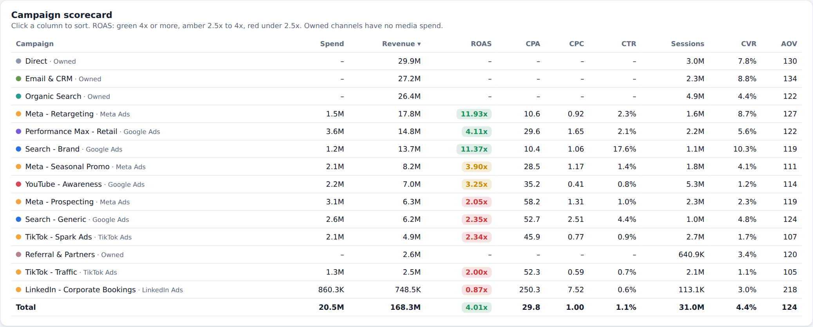
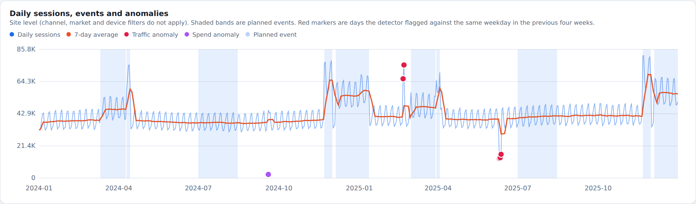
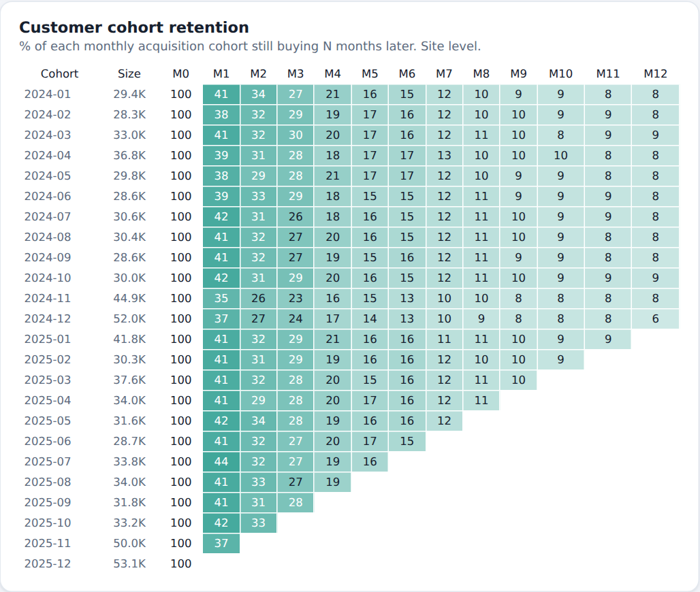

# GA4 + Paid Media Performance Dashboard

An interactive marketing performance dashboard for a GCC retail and entertainment brand, built end to end: synthetic GA4-style data, a star schema, Python analysis, an anomaly detector, SQL queries, and a Power BI build kit.

**Live dashboard:** https://melroy88.github.io/ga4-ad-performance-dashboard/dashboard/
(or download `dashboard/index.html` and double-click it. No server or internet needed.)



## Why this project
I have spent 17+ years running digital marketing in the GCC. The questions a Head of Digital gets every week are always the same: *Where is the money working? Where is it leaking? What happened last Tuesday?* This project answers those questions with the same tools I use at work (GA4-style events, paid media data, Power BI, SQL) plus Python for the parts spreadsheets do badly.

## Data (important)
All data is **synthetic**, generated with a fixed random seed (`src/generate_data.py`, seed 2026). "Marhaba Lifestyle" is a fictional brand. No real company, customer or campaign data is used. I built the generator to behave like a real GCC business:

- 14 campaigns across Google Ads, Meta, TikTok, LinkedIn plus owned channels (organic, email, direct, referral)
- 5 markets (UAE, KSA, Qatar, Oman, Bahrain) and 3 devices
- Jan 2024 to Dec 2025, weekly campaign grain (22,050 rows) plus a daily site table
- Seasonality: Ramadan, Eid, Summer promo, White Friday, Dubai Shopping Festival, weekday and Friday/Saturday patterns
- Deliberately injected incidents so the detector has something real to find: a GA4 tag outage (10 to 12 Jun 2025), a Meta budget spike (18 to 19 Sep 2024) and a viral organic spike (20 to 21 Feb 2025)

### Tables (`/data`)
| Table | Grain | Key columns |
|---|---|---|
| `fact_performance_weekly` | week x campaign x country x device | impressions, clicks, spend_aed, sessions, engaged_sessions, new_users, add_to_cart, begin_checkout, purchases, revenue_aed |
| `fact_site_daily` | day | sessions, purchases, revenue_aed, spend_aed, weekday, event |
| `fact_cohort_retention` | acquisition month x months since | cohort_size, active_customers |
| `dim_campaign` | campaign | platform, channel_group, kind (paid / owned), budget, base CPC, base CTR |
| `dim_country`, `dim_device`, `dim_date` | | events, weekday, month, quarter |

## Business questions answered
1. Which paid campaigns earn their budget, and which do not?
2. Where does the purchase funnel leak most?
3. Is mobile under-converting, and by how much?
4. How much do Ramadan, Eid and White Friday really lift revenue?
5. Are customers acquired in discount months worth as much later?
6. Did anything break in tracking or spend that we would otherwise miss?

## Key findings
| # | Finding | Number |
|---|---|---|
| 1 | Total revenue over 24 months | AED 168.3M, from 31.0M sessions and 1.36M orders (CVR 4.38%) |
| 2 | Growth | 2025 vs 2024: revenue +4.5%, sessions +3.7%, spend +6.2%. Spend grew faster than revenue. |
| 3 | Best and worst paid campaigns | Meta Retargeting 11.9x ROAS and Search Brand 11.4x, versus LinkedIn Corporate Bookings 0.87x |
| 4 | Biggest budget line | Performance Max takes 17.6% of paid budget at 4.1x. Test incrementality before scaling it. |
| 5 | Wasted spend | Meta Prospecting (15.1% of spend, 2.05x), Search Generic (12.8%, 2.35x) and TikTok Spark (10.2%, 2.34x) hold 38% of paid budget but return 21% of paid revenue |
| 6 | Mobile gap | 72% of sessions, 3.85% CVR versus 5.97% on desktop |
| 7 | Funnel leak | Only 22.7% of engaged sessions add to cart. After that, 52.1% start checkout and 61.5% buy. |
| 8 | Seasonality | White Friday 2025 lifts daily revenue about +198% over a same-weekday baseline. Ramadan 2025 about +34%. |
| 9 | Cohort quality | Nov/Dec promo cohorts retain 23.8% at month 3 versus 27.8% for regular months |
| 10 | Creative fatigue signals | TikTok CPC rose from 0.66 to 0.73 AED, Meta Prospecting CTR fell from 1.08% to 0.96% |
| 11 | Markets | UAE is 47.5% of revenue. Oman has the lowest CVR (3.74%). |

**Recommended actions:** move budget from the three "review" campaigns to Retargeting and Brand up to their saturation point, fix the mobile product page and cart step, add a 30/60/90-day CRM sequence for promo cohorts, and put a tracking alert on daily sessions.

## Screenshots
| Filtered view: 2025, Saudi Arabia | Campaign scorecard |
|---|---|
|  |  |

| Anomalies and events | Cohort retention |
|---|---|
|  |  |

Full page: [`images/00_full_page.png`](images/00_full_page.png)

> **Honest note on tools:** these screenshots are of the interactive HTML dashboard I built (vanilla JavaScript and SVG). Power BI and Tableau are desktop tools, so this repo ships a complete **Power BI build kit** in `/powerbi` (data model, 30+ DAX measures, page wireframes, theme, and Tableau equivalents) that reproduces the same numbers.

## Approach
```
generate_data.py  ->  data/*.csv (star schema)
                          |
        analyse.py  ->  outputs/*.csv + insights.json (scorecards, funnel, uplift, cohorts, anomalies)
                          |
   build_dashboard.py ->  dashboard/index.html (data + insights bundled, self-contained)
                          |
   load_sqlite.py     ->  sql/marketing.db  ->  sql/marketing_queries.sql (10 queries)
```
**Anomaly detection:** each day is compared with the median of the same weekday over the previous four weeks (log ratio). A day is flagged when its robust z-score is above 4 and the change exceeds 30%. Planned events and the 28 days after them are muted so promotions are not reported as incidents. On this dataset it finds exactly the three injected incidents (12 flagged days) and nothing else.

**Metrics:** ROAS = attributed revenue / spend (paid only). CPA = spend / purchases. CVR = purchases / sessions. AOV = revenue / purchases. Owned channels carry no media cost, so they are excluded from ROAS and CPA.

## How to run
```bash
git clone https://github.com/MELROY88/ga4-ad-performance-dashboard.git
cd ga4-ad-performance-dashboard
pip install -r requirements.txt
python src/generate_data.py      # rebuilds /data
python src/analyse.py            # rebuilds /outputs
python src/build_dashboard.py    # rebuilds dashboard/index.html
python src/load_sqlite.py && sqlite3 sql/marketing.db < sql/marketing_queries.sql
```
Deep links work: `dashboard/index.html?year=2025&country=SA`. The screenshots and derived files in this repo are also rebuilt automatically by a GitHub Action (`.github/workflows/build.yml`) on every push.

## Repo layout
```
data/         star-schema CSVs
src/          data generator, analysis, dashboard builder, SQL loader, screenshot script
dashboard/    template.html (source) and index.html (built, self-contained)
sql/          10 marketing queries (window functions, CTEs, cohort, anomaly screen)
powerbi/      data model, DAX measures, build guide, theme.json
outputs/      analysis tables and insights.json
images/       README screenshots
```

## Limitations
- Data is synthetic, so the findings show the method, not real market truth.
- ROAS uses the attribution built into the data. A real project would compare last-click with data-driven attribution and run geo or holdout tests for incrementality.
- The SQL anomaly screen (query 9) is deliberately simpler than the Python detector.
- Event uplift in SQL (query 8) uses the average non-event day as a baseline, so it reads higher than the same-weekday figures in the dashboard.

## Next steps
Marketing mix model and budget optimiser (project 2), live GA4 export to BigQuery, automatic Slack alerts on anomalies.

## Tech stack
Python (pandas, numpy), SQL (SQLite), JavaScript and SVG, Power BI/DAX (build kit), Playwright, GitHub Actions.

## Author
**Melroy Lopes**, Digital Marketing Manager (17+ years in the GCC), moving into data science and AI.
[LinkedIn](https://www.linkedin.com/in/melroylopes/) · [Portfolio](https://melroy.lovable.app) · [GitHub profile](https://github.com/MELROY88)

Licensed under MIT.
